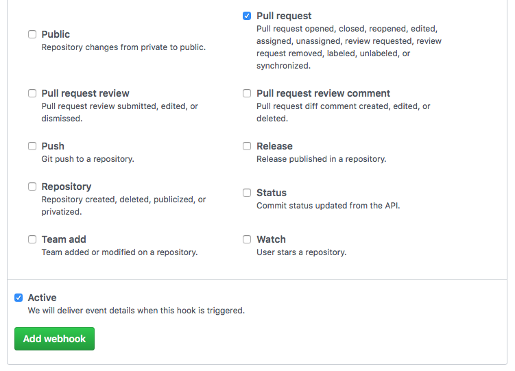

# Using AWS CodeBuild as a CI Service in GitHub
This application integrates CodeBuild with GitHub. This project allows you to run builds on every pull request automatically using CodeBuild.

## Infrastructure

The included CloudFormation template creates:

- Lambda Function
- API Gateway
- CodeBuild Project
- CloudWatch Event Rule
- IAM Roles for Lambda Function, CodeBuild Project, and API Gateway

## Setup

**Step 1: Create Deployment Package**

First, we have to create a deployment package for Lambda and upload it to S3. You can create a deployment package by navigating to the root of the repository and running the `create_deployment_package.sh` script.

```
$ ./create_deployment_package.sh
```
This will output a zip file called `codebuild-ci-lambda.zip`. Upload that to any S3 bucket in the same region that you will be creating your infrastructure in. (Currently in Pragmatic's S3 bucket with the name awscitest)

**Step 2: Get API Token**

We must get an API token to authenticate with GitHub. We will reference this in our CloudFormation template so our Lambda function can create Statuses.

To create an API token [See the GitHub documentation.](https://help.github.com/articles/creating-a-personal-access-token-for-the-command-line/)


**Step 3: Link CodeBuild to GitHub**


We must authenticate CodeBuild to our GitHub account so it can see our repositories. It requires read only access in order to pull code during a run.

1. Login to your AWS Account and go to the CodeBuild Console.
2. If you have never used CodeBuild, click the "Get Started". If you have used it before, click "Create Project".
3. Under the heading **"Source: What to build"**, select `GitHub` as your _Source provider_.
4. Click the button that says **"Connect to GitHub"**
5. Allow CodeBuild access to your repositories. Then you should get redirected back to the CodeBuild page.
6. Click "Cancel" at the very bottom.

We can just cancel out of our project creation because our CloudFormation project will create the project for us. We simply needed to establish an OAuth relationship with CodeBuild.


**Step 4: Create Infrastructure**

We can now create our infrastructure in AWS. Upload the Cloudformation template (codebuild-ci.json) to create a new CF Stack. 

The template has the follow Parameters:

- `RepositoryUrl` - HTTPS Clone URL of the repository in GitHub. Example: 'https://github.com/owner/repo.git'
- `GithubToken` - GitHub API Token used for Status creation.
- `ProjectName` - Name to give the CodeBuild Project. For this sample, use the same name as your repository.
- `S3Key` - S3 Key for Lambda Function Zip
- `S3Bucket` - S3 Bucket name for Lambda Function Zip
- `BuildImage` - Docker Image to use in CodeBuild Project

**Step 5: Setup GitHub**

Now we can navigate to our repository in GitHub and go to the Settings page. Under the "Webhooks" section, we can click _Add webhook_ in the upper right. Here we can paste in the https url for our API Gateway endpoint that we grabbed from Step 4. Change the _content-type_ to `application/json`.

Under the _Which events would you like to trigger this webhook?_ heading, select the "Let me select individual events." option. Then check the `Pull Request` box and deselect the `Push` box. Make sure the 'Active' box is checked then click "Add webhook".



You should then see a green checkmark by your webhook url.

_To learn more about adding webhooks to a repository, [see the GitHub documentation](https://developer.github.com/webhooks/creating/)_

**Step 6: Open a Pull Request**

That should be all we need! To try it out, simply open a new pull request in your repository. You should see a Status of `pending` appear with a link to CodeBuild. The Status will be updated once the build completes. A build will be triggered whenever a pull request is Opened, Reopened, or Synchronized (pushed to).

**Don't forget to add a [buildspec.yml](http://docs.aws.amazon.com/codebuild/latest/userguide/build-spec-ref.html) file to your repository.** This is required by CodeBuild to know what commands to run.

Credit: Graham Krizek on GitHub
